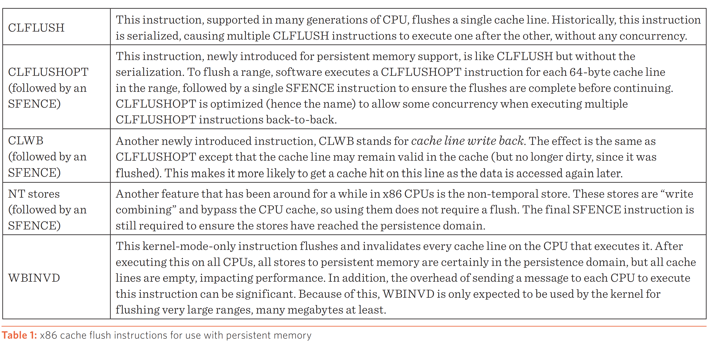

# Notes on Persistent Memory Related Security Issues

Hopefully this will be my PhD research project.

## Reading List

1. [Witcher: Systematic Crash Consistency Testing for Non-Volatile Memory Key-Value Stores](https://www3.cs.stonybrook.edu/~dongyoon/papers/SOSP-21-Witcher.pdf) SOSP'21
2. [Hippocrates: Healing Persistent Memory Bugs Without Doing Any Harm Extended Abstract](https://dl.acm.org/doi/abs/10.1145/3445814.3446694) ASPLOS'21
3. [RECIPE: Converting Concurrent DRAM Indexes to Persistent-Memory Indexes](https://dl.acm.org/doi/10.1145/3341301.3359635) SOSP'19
4. [Write-Optimized and High-Performance Hashing Index Scheme for Persistent Memory](https://www.usenix.org/conference/osdi18/presentation/zuo) OSDI'18
5. [PMTest: A Fast and Flexible Testing Framework for Persistent Memory Programs](https://dl.acm.org/doi/10.1145/3297858.3304015) ASPLOS'19
6. [AGAMOTTO: How Persistent is your Persistent Memory Application?](https://www.usenix.org/conference/osdi20/presentation/neal) OSDI'20
7.  [MOD: Minimally Ordered Durable Datastructures for Persistent Memory](https://dl.acm.org/doi/10.1145/3373376.3378472) ASPLOS'20
8. [Cross-Failure Bug Detection in Persistent Memory Programs](https://dl.acm.org/doi/10.1145/3373376.3378452) ASPLOS'20
9. [DURINN: Adversarial Memory and Thread Interleaving for Detecting Durable Linearizability Bugs](https://www.usenix.org/conference/osdi22/presentation/fu) OSDI'22
10. [Mnemosyne: Lightweight Persistent Memory](https://pages.cs.wisc.edu/~swift/papers/asplos11_mnemosyne.pdf) ASPLOS'11
11. [NV-Heaps: Making Persistent Objects Fast and Safe with Next-Generation, Non-Volatile Memories](http://mesl.ucsd.edu/pubs/Coburn_ASPLOS11.pdf) ASPLOS'11
12. [Yat: A Validation Framework for Persistent Memory Software](https://www.usenix.org/system/files/conference/atc14/atc14-paper-lantz.pdf) ATC'14
13. [Crash Consistency in Encrypted Non-Volatile Main Memory Systems](https://ieeexplore.ieee.org/document/8327018) HPCA'18
14. [PMFuzz: Test Case Generation for Persistent Memory Programs](https://www.cs.virginia.edu/~smk9u/Liu_PMFuzz_ASPLOS21.pdf) ASPLOS'21
15. [Atlas: Leveraging Locks for Non-volatile Memory Consistency](https://dl.acm.org/doi/pdf/10.1145/2714064.2660224) OOPSLA'14

## Persistent Memory Background Knowledge

Some articles/talks worthing reading are:

1. Andy Rudoff's articles on USENIX: [Programming Models for Emerging NonVolatile Memory Technologies](https://www.usenix.org/system/files/login/articles/08_rudoff_040-045_final.pdf), [Persistent Memory Programming](https://www.usenix.org/system/files/login/articles/login_summer17_07_rudoff.pdf)
2. Intel [persistent memory docs](https://www.intel.com/content/www/us/en/developer/topic-technology/persistent-memory/overview.html)
3. [Persistent Memory Documentation](https://docs.pmem.io/persistent-memory/)

### The first question here: **what is** Persistent Memory?

Before we get started, a few confusing concepts need to be addressed beforehand. You might come across many terms on new types of "memory", such as non-volatile memory (NVM), storage-class memory and our main character today, persistent memory. Well, these "memory" nouns look quite distinct, but they can all be categorized according to the definition of persistent memory. That is to say, when you encounter these confusing nouns in the future, just keep in mind that these little bastards are all persistent memory. In the rest of this note, I may use non-volatile memory (NVM) or persistent memory (PM or pmem) in an interleaving style.

Let's move to the main part.

Peristent memory, as we can easily tell by its name, provides a nice property of **persistency** while functioning as memory. More than "peristence", persistent memory also provides properties of byte-addressability, load/store memory access. Whoa! Its properties are amazing, how about the performance compared to current memory such as DRAM? According to [Lenovo](https://lenovopress.lenovo.com/lp1528.pdf), Intel Optane PM (a type of mainstream persistent memory on market) acquires higher capacity, cheaper price than DRAM, but suffers from higher latency and smaller bandwith. Its role in the memory hierarchy is shown below:

 
> source: https://docs.pmem.io/persistent-memory/getting-started-guide/introduction

### The second question: what is **so good** about Persistent Memory?

As mentioned above, persistent memory provides persistency, byte-addressability and direct memory access (DAX) using load/store instructions. In this part, we will focus mainly on how these properties make PM great again! (Just a informal joke lol..)

* DAX with load/store instructions
  
  This property requires the support from PM-aware file systems. With such support, user-space applications may use load/store instructions to directly manipulate memory in PM without going through the page cache.

* byte-addressability
  
  This property is highly associated with cache. Contents from PM can be cached before being used. Cache (refer to L3 cache mostly) provides programmers with so-called cache-line granularity, which are treated by programmers as bytes.

* persistency
  
  Finally! We come to the most outstanding feature of PM. This property is simple: any data that is stored on the PM is "persisted", meaning that you will not lose such data after power down or restart. Persisting such data can be achieved using the store instruction.

Whoo..let's take a breath. Just looking over at the nice properties of PM, you might can help wondering what an amazing thing PM is. With PM, I can write whatever codes I like and do not need to worry about whether an unexpected crash may cause data loss or some misfunction of my software. Just get a PM-aware file system and use the store instruction to directly access PM, there would be no need to worry about cache during crash and everything would be great! 

Only if things were this simple...Dreams are fascinating but reality sucks.

### The third question: what is **not so good** about Persistent Memory?

To answer this question, first we need to really really think about another question: when accessing PM with DAX, setting aside the L3 cache, does PM really have nothing to do with cache? Do we really just use store instruction and the data is directly persisted to PM. Is it really really the case? If not, what are we missing?

I bet some people have noticed that there is one cache I can in no way avoid: the cache in CPU. Well, this is the Achilles' heel of PM. PM can not avoid the cache in CPU, thus when a store instruction is issued, there is a high chance that such data is cached in the CPU and might be lost permanently due to a sudden system crash.

> source: https://www.usenix.org/system/files/login/articles/login_summer17_07_rudoff.pdf

What's worse is that since there are a huge anount of instructions executed in one CPU per second, the eviction of cache lines inside CPU (i.e., L1, L2 cache) is hard to estimate or monitor due to the cache prediction mechanism deployed in the hardware. Therefore, if PM programmers only use the store instructions to persist data, it is hard to tell whether the data is still cached inside CPU or has already been persisted. And some naive programmers might just think that their data are well persisted after the store instruction and forget about all the other rules, possibly causing some undetected software bugs.

### The fourth question: what challenges is Persistent Memory facing?

Let's first continue with our third question. Well, since we can not directly monitor the eviction of CPU cache lines simply using some high-level codes, is there nothing else we could do to address this problem? Of course not! Thank god the world is not filled with software guys, we have hardware engineers to help us out. 

In the x86 architecture, we have some instructions to take control of the CPU cache lines: CLWB, CLFLUSH, SFENCE and etc. Most of details are shown in the figure below.

> source: https://www.usenix.org/system/files/login/articles/login_summer17_07_rudoff.pdf

> SFENCE instruction: Orders processor execution relative to all memory stores prior to the SFENCE instruction. The processor ensures that every store prior to SFENCE is globally visible before any store after SFENCE becomes globally visible. The SFENCE instruction is ordered with respect to memory stores, other SFENCE instructions, MFENCE instructions, and any serializing instructions (such as the CPUID instruction). It is not ordered with respect to memory loads or the LFENCE instruction.

We now have a solution to our third question!! To ensure that a store to PM is actually persisted, we can issue a CLWB instruction followed by a SFENCE instruction, so that this store instruction is guaranteed to be persistent. But such instructions can not be used at random will since they are expensive, which may reduce a system's performance, according to [Neal et al. their paper of OSDI'20](https://www.usenix.org/conference/osdi20/presentation/neal).

Therefore here comes our first challenge:

**How to properly keep programming to PM secure (i.e., ensure that data is actually persisted) and efficient (i.e., use persistence instruction as CLWB+SFENCE in an appropriate manner)?**

Moreover, PM is expected to play an important role in future memory hierarchy and expose itself to programmers in a similar way as DRAM, but currently, most of our memory data structures are designed for DRAM or so. 

And here comes our second challenge:

**How to fit PM into today's memory programming world in a elegant way so that programmers will write codes as usual (i.e., DRAM programming) and do not need to make much adaption?**

## [RECIPE: Converting Concurrent DRAM Indexes to Persistent-Memory Indexes](https://dl.acm.org/doi/10.1145/3341301.3359635)